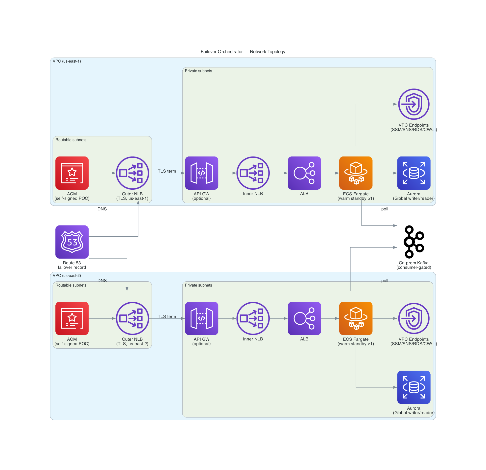
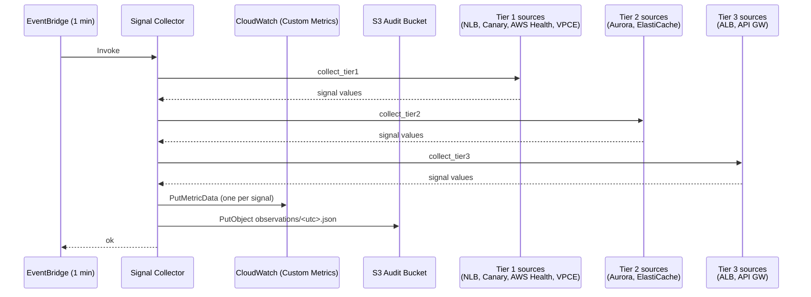
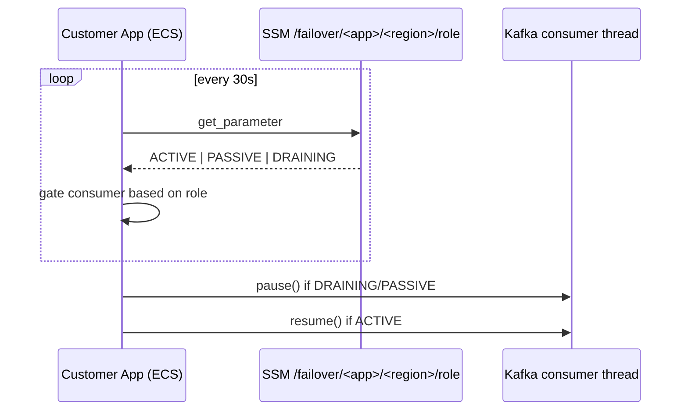
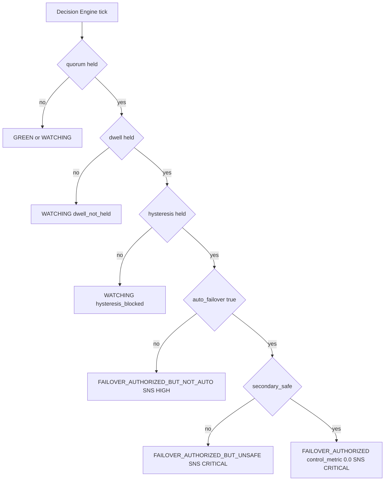
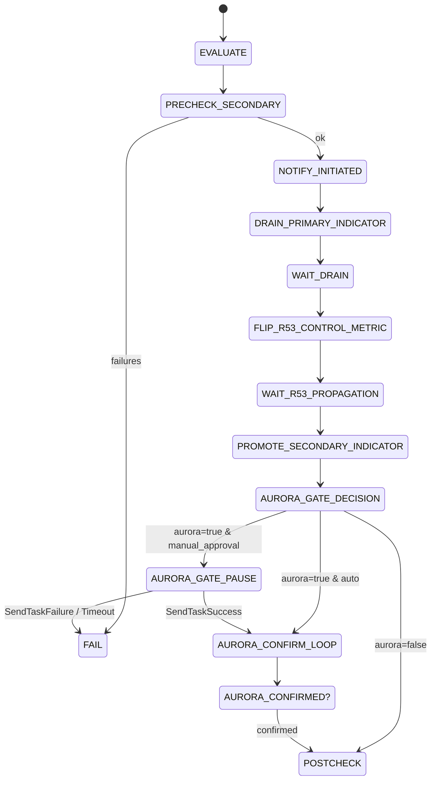

# Customer Walkthrough — Multi-Region Failover Orchestrator

**Audience:** Customer engineering leadership, SRE, and architecture reviewers.
**Purpose:** End-to-end picture of how the orchestrator works in steady state,
how it detects problems, and what happens for each class of incident.

This doc stitches existing diagrams (`docs/diagrams/`) and scenario walkthroughs
(`docs/scenarios/`) into a narrative. For deeper detail on any single piece,
follow the links inline.

---

## 1. The 30-second pitch

A profile-driven multi-region failover orchestrator for ECS Fargate workloads.
It runs in **two regions simultaneously** (`us-east-1` active, `us-east-2`
warm-passive), continuously collecting health signals from both regions, and
moves traffic from the active region to the warm region only when **four
independent gates** all agree that the failure is real, sustained, and the
secondary is ready to take traffic.

**Design priorities, in order:**
1. **Don't false-positive.** Failover budget: 0 unnecessary failovers per quarter.
2. **Recover quickly when the failure is real.** RTO: 15 minutes from authorization.
3. **Operator stays in the loop on data.** Aurora promotion is always
   manual — the orchestrator confirms but never initiates.

**SLO targets:**

| Metric | Target |
|---|---|
| RTO (failover authorized → traffic on secondary) | 15 minutes |
| RPO (worst-case data loss from Aurora replica lag) | 5 minutes |
| Decision latency (signal red → decision evaluated) | 1 minute |
| False-positive failovers | 0 per quarter |

---

## 2. Network topology

The orchestrator co-exists with the customer application. Every region runs
the **same complete stack** — only the indicator parameter (ACTIVE vs
PASSIVE) and the Route 53 health-check status differ.



Key properties:

- **No internet egress.** Every Lambda is VPC-attached in private subnets;
  every AWS API call leaves through an **interface VPC endpoint** in the
  same region. S3 uses a **gateway endpoint**.
- **TLS terminates at the ALB.** The outer NLB is TCP passthrough; the ALB
  presents the application's certificate.
- **Aurora is a Global Database.** Writer in active region, reader in
  passive. Cross-region replication lag is a Tier 2 signal (gates safety,
  doesn't trigger failover).
- **Self-signed CA in the POC** (operator-trusted via per-app profile).
  JPMC port substitutes its existing PKI.

For the same picture with VPC-endpoint specifics see
[`docs/diagrams/12-vpc-and-endpoints.py`](diagrams/12-vpc-and-endpoints.png).

---

## 3. Steady state — what happens every minute

Two things happen on a 1-minute cadence in **each region independently**:

### 3.1 Signal collection

Every minute, an EventBridge rule invokes the **Signal Collector Lambda**.
It pulls health data from three tiers of sources, emits one CloudWatch
custom metric per signal, and writes a JSON observation snapshot to S3 for
audit.



### 3.2 What gets collected

Three tiers, by purpose:

**Tier 1 — only this tier can *trigger* a failover.**

| Signal | What it measures | When it goes red |
|---|---|---|
| `outer_nlb_unhealthy` | Outer NLB target health | All targets unhealthy for ≥ dwell window |
| `cross_region_canary_fail` | Synthetics canary in the **opposite** region probing **this** region's public endpoint | Failure rate ≥ 80% (configurable) |
| `aws_health_open` | AWS Health API events for this region (**optional** — requires Business+ Support tier and a Health VPCE; treated as permanently green if unavailable) | Any open issue affecting our services |
| `vpc_endpoint_errors` | VPC interface endpoint failure count | >0 errors in dwell window |

**Tier 2 — gates *whether* failover is safe (data tier).**

| Signal | What it measures |
|---|---|
| `aurora_writer_location` | Which region currently has the Aurora writer |
| `aurora_replica_lag_high` | Cross-region replication lag (must be ≤ RPO budget) |
| `elasticache_replication` | ElastiCache replication state (when used) |

**Tier 3 — informational only; never triggers, never gates.**

| Signal | What it measures |
|---|---|
| `alb_unhealthy` | Inner ALB target health |
| `api_gw_5xx` | API Gateway 5xx error rate |

The split exists because Tier 3 (`alb_unhealthy`, `api_gw_5xx`) goes red on
routine deployment blips. Tier 1 (NLB, cross-region canary, AWS Health,
VPC endpoints) only goes red when the **infrastructure** is genuinely
degraded.

### 3.3 Indicator publishing

In parallel, the **Indicator Updater** writes the current region's role
(`ACTIVE` / `PASSIVE` / `DRAINING`) to SSM Parameter Store. The customer's
application reads this parameter to gate region-specific behavior — most
importantly, **whether to consume from Kafka** (only the ACTIVE region
should consume, to prevent split-brain at the message-bus layer).



---

## 4. Detection — when does the orchestrator decide to act

Every minute (offset 30s from signal collection), the **Decision Engine
Lambda** runs in each region. It reads the last N minutes of CloudWatch
metrics for every signal, evaluates **four sequential gates**, and emits
one of: `GREEN`, `WATCHING`, `FAILOVER_AUTHORIZED_BUT_NOT_AUTO`,
`FAILOVER_AUTHORIZED_BUT_UNSAFE`, `FAILOVER_AUTHORIZED`.



**The four gates, in order:**

| Gate | Default | Stops what |
|---|---|---|
| **Quorum** | ≥ 2 distinct Tier 1 signals red | Single-signal blips (one canary failure, one VPC endpoint hiccup) |
| **Dwell** | red for ≥ 5 consecutive minutes | 3-minute deployment blips, transient AZ events |
| **Hysteresis** | ≥ 3 minutes since last decision change | Oscillation when signals flap |
| **`auto_failover` flag** | `false` for first 30 days per app | Operator stays in the loop while the app's noise floor is being characterized |

When all four gates hold, the orchestrator publishes the
`PrimaryHealthControl` CloudWatch metric value `0.0`. A pre-existing alarm
fires, which trips a **Route 53 health check**, which flips the **R53
failover record** to point at the secondary region.

This is the **Route 53 control pattern**: orchestrator never calls the
Route 53 API directly. It only changes a CloudWatch metric. R53 reacts on
its own. See [`docs/diagrams/08-r53-control-pattern.md`](diagrams/08-r53-control-pattern.md).

> **Want the gate-by-gate scenario walkthrough?** See
> [`docs/diagrams/15-detection-logic-walkthrough.md`](diagrams/15-detection-logic-walkthrough.md)
> — annotates each gate with the specific incident types it filters out,
> plus a verdict matrix mapping all 14 SPEC scenarios to their stop-gate
> and final outcome.

---

## 5. Action — what failover looks like end-to-end

Failover is carried out by a **Step Functions Standard state machine**.
DNS-first variant (default for read-tolerant apps):



**Step-by-step narrative:**

| Step | Duration | What happens |
|---|---|---|
| `PRECHECK_SECONDARY` | seconds | Confirm secondary has ≥1 ECS task running and no Tier 1 signals red there |
| `NOTIFY_INITIATED` | seconds | Publish `failover_initiated` SNS event to operator topic |
| `DRAIN_PRIMARY_INDICATOR` | seconds | Set primary region's role to `DRAINING` — customer app pauses Kafka consumer |
| `WAIT_DRAIN` | 60s default | Allow in-flight work to complete |
| `FLIP_R53_CONTROL_METRIC` | seconds | Publish `PrimaryHealthControl=0.0` — R53 health check trips |
| `WAIT_R53_PROPAGATION` | 90s default | Allow R53 DNS TTL window to drain |
| `PROMOTE_SECONDARY_INDICATOR` | seconds | Set secondary region's role to `ACTIVE` — customer app resumes Kafka consumer in new region |
| `AURORA_GATE_PAUSE` | **operator-paced** | SFN pauses with a task token. SNS alerts on-call. Operator runs `failoverctl approve` after manually promoting Aurora writer to secondary region. |
| `AURORA_CONFIRM_LOOP` | up to 5 min | Polls RDS until Aurora writer is confirmed in secondary |
| `POSTCHECK` | seconds | Verify secondary still healthy after the move |
| `DEMOTE_SOURCE_INDICATOR` | seconds | Set primary region's role to `PASSIVE` (terminal post-failover state) |
| `NOTIFY_COMPLETED` | seconds | Publish `failover_completed` SNS event |

**Why DNS-first:** the customer app is read-tolerant during the brief window
where R53 has flipped but Aurora is still being promoted. Reads continue
serving from the new region against the still-replicating Aurora reader;
writes are deliberately gated until the operator confirms Aurora promotion.

For the failback flow (always operator-triggered, mirrors failover with a
QUIESCE wait between drain and R53 flip) see
[`docs/diagrams/06-failback-statemachine.md`](diagrams/06-failback-statemachine.md).

---

## 6. Scenarios — what the orchestrator does for each kind of incident

The full set of 14 scenarios is in [`docs/scenarios/`](scenarios/). Below
are five representative cases that cover the design space. Each scenario has
its own minute-by-minute Mermaid sequence diagram in its own file.

### 6.1 Deployment 503 blip — **no failover**

Application deploy causes `/actuator/health` to return 503 for 3 minutes in
the primary region.

- Tier 3 signals (`alb_unhealthy`) go red.
- Tier 1 signals (`outer_nlb_unhealthy`, canary, AWS Health, VPCE) **stay
  green** — NLB sees pre-existing healthy targets at the LB level.
- Quorum gate fails → Decision Engine reports `GREEN` throughout.
- **Outcome:** no failover. SRE on-call sees an SNS info-level signal
  observation but no action required.

Full walkthrough: [`scenarios/scenario-01-deployment-503-blip.md`](scenarios/scenario-01-deployment-503-blip.md).

### 6.2 Single-AZ outage — **no failover**

One AZ in the primary region becomes unreachable.

- ALB targets in the affected AZ go unhealthy.
- NLB cross-zone load balancing keeps overall NLB target count healthy
  (≥1 healthy in another AZ).
- Tier 1 quorum never met. **Outcome:** no failover; the in-region recovery
  path (ASG/ECS replacing tasks in healthy AZs) handles it.

Full walkthrough: [`scenarios/scenario-03-single-az-outage.md`](scenarios/scenario-03-single-az-outage.md).

### 6.3 Full region outage — **failover**

`us-east-1` becomes unreachable: NLB targets unhealthy, cross-region
canary failing, AWS Health open issue, VPC endpoints erroring.

- All four Tier 1 signals red simultaneously.
- Quorum (≥2 of 4) ✓ → Dwell (5 min) ✓ → Hysteresis ✓ → `auto_failover`
  ✓ (in production) → Secondary safe ✓.
- `FAILOVER_AUTHORIZED` published; SFN `failover` execution starts.
- DNS flips, indicator updated, **operator approves Aurora**, SFN completes.
- **Outcome:** traffic on `us-east-2`, both indicators in their final
  state (`us-east-1=PASSIVE`, `us-east-2=ACTIVE`).

Full walkthrough: [`scenarios/scenario-04-full-region-outage.md`](scenarios/scenario-04-full-region-outage.md).

### 6.4 Operator runs a dry-run — **no mutation**

Operator runs `failoverctl failover --dry-run` to validate the orchestration
end-to-end without affecting production.

- SFN runs every step (precheck, notify, indicator, R53 flip, Aurora
  confirm, postcheck), but every mutating Lambda emits a
  `dry_run_action_skipped` log line and returns without writing.
- Every SNS subject is prefixed `[DRY-RUN]`.
- **Outcome:** all SFN steps reach `STABLE_SECONDARY`. No SSM parameters
  written, no R53 metric flipped, no Aurora touched.

Full walkthrough: [`scenarios/scenario-07-dry-run.md`](scenarios/scenario-07-dry-run.md).

### 6.5 Split-brain attempt — **rejected**

Two operators trigger failover at the same time using the same execution
ID.

- First `StartExecution` succeeds; second one with the same name + same
  input returns the **same execution ARN** (idempotent — both operators
  end up watching the same execution).
- Same name with **different** input is rejected with
  `ExecutionAlreadyExists`.
- **Outcome:** exactly one failover runs, ever, per execution name. No
  way to get two parallel failovers in flight.

Full walkthrough: [`scenarios/scenario-12-split-brain-attempt.md`](scenarios/scenario-12-split-brain-attempt.md).

### Other scenarios at a glance

| # | Scenario | Outcome |
|---|---|---|
| 02 | ALB unhealthy only | No failover (Tier 3 only) |
| 05 | API GW 5xx storm | No failover (Tier 3 only) |
| 06 | App can't reach Aurora | No failover (Tier 2 informational; SRE alerted) |
| 08 | Manual failover with Aurora approval gate | Operator-paced full flow |
| 09 | Aurora confirmation never arrives | SFN times out; CRITICAL alert; system in known-stuck state for human triage |
| 10 | Failback after stable secondary | Mirror of failover, always operator-triggered |
| 11 | Mid-failover Lambda crash | SFN Catch+Retry recovers automatically |
| 13 | Profile change mid-incident | New profile picked up on next Decision Engine tick (~60s) |
| 14 | Canary in opposite region itself fails | Decision Engine ignores the signal until canary recovers |

Full walkthroughs in [`docs/scenarios/`](scenarios/).

---

## 7. Operator interface

Two paths:

1. **`failoverctl` CLI** — thin boto3 wrapper. Subcommands: `status`,
   `failover`, `failback`, `dry-run`, `approve`, `abort`, `tail-logs`.
2. **Direct `aws lambda invoke`** — escape hatch for any operator who
   prefers the underlying API.

There is **no** API Gateway, web UI, or chat-bot front door in the POC.
JPMC port adds these as a separate concern — they're operator-experience
sugar, not part of the safety boundary.

### Notifications (SNS)

Every event is published to a single account-level SNS topic with a
human-friendly subject and body, plus the structured payload for
programmatic consumers.

**Subject format:**

```
[<SEVERITY>] <Title>: <app> (<context>)
```

Examples:

- `[CRITICAL] Failover started: payments (us-east-1 → us-east-2)`
- `[CRITICAL] OPERATOR ACTION REQUIRED: Approve Aurora promotion (payments → us-east-2)`
- `[INFO] Failover COMPLETED: payments (us-east-1 → us-east-2)`
- `[DRY-RUN] Failover started: payments (us-east-1 → us-east-2)`

**Body format:**

```
FAILOVER STARTED

App:        payments
Severity:   CRITICAL
Event:      failover_initiated
Source:     us-east-1
Target:     us-east-2
Operator:   sre@org.com
Failover ID: failover-payments-20260428-failover-000-7cc2696d

Next steps:
  1. Confirm the failover is intentional — if not, run
     `failoverctl abort --execution-id <id>` immediately.
  2. Stand by for the AURORA APPROVAL REQUIRED notification
     (if Aurora is in scope for this app).

--- raw event payload (JSON) ---
{
  "app_name": "payments",
  "event": "failover_initiated",
  ...
}
```

The text summary is what email/SMS/Slack subscribers see first. The JSON
after the `--- raw event payload ---` separator is for Lambda/SQS
subscribers that need structured data — split on the separator and
`json.loads` the second half.

**Subscription policies** filter on the SNS message attributes:
`app_name`, `event`, `severity`, `dry_run`. So an SRE on-call subscription
can match `severity ∈ {CRITICAL, HIGH}`, while an audit-log subscription
matches everything.

For the day-to-day operator's view, see [`docs/operations.md`](operations.md)
and the runbooks in [`runbooks/`](../runbooks/).

### Profile delivery

The profile YAML is delivered to Lambdas one of two ways:

- **S3 mode (default):** Lambdas read `s3://<app>-profiles-<account>-<region>/<app>/profile.yaml`
  on every invocation. Profile updates: upload to primary bucket → CRR replicates → next minute tick picks it up.
- **Env-var mode (opt-in):** Lambdas read the YAML from a `PROFILE_YAML`
  environment variable. No runtime S3 dependency; profile changes flow
  through `terraform apply` and are visible in the IaC plan diff.

Tradeoffs and switching guide: [`profile-delivery-modes.md`](profile-delivery-modes.md).

---

## 8. What the orchestrator does NOT do

These are intentional boundaries, not gaps:

- **Does not promote Aurora automatically.** Every Aurora writer flip is
  operator-triggered via `SendTaskSuccess` on a paused state. The
  orchestrator confirms but never initiates.
- **Does not auto-failback.** Even when `auto_failover=true`,
  `auto_failback` stays false. Failback is always a human decision,
  triggered after the operator is satisfied the original region is healed.
- **Does not call the Route 53 API directly.** Only writes a CloudWatch
  metric value. R53 reacts via health-check on its own.
- **Does not talk to AWS over the public internet.** Every Lambda is
  VPC-attached; every API call uses an in-region VPC interface endpoint.

---

## 9. Reading further

| For | Read |
|---|---|
| Component-by-component depth | [`architecture.md`](architecture.md) |
| Why a failover authorizes (full rule) | [`decision-engine.md`](decision-engine.md) |
| Day-to-day operator guide | [`operations.md`](operations.md) |
| Adding a new app to the orchestrator | [`onboarding-new-app.md`](onboarding-new-app.md) |
| Profile schema reference | [`profile-reference.md`](profile-reference.md) |
| Failure modes catalog | [`failure-modes.md`](failure-modes.md) |
| Per-scenario walkthroughs | [`scenarios/scenario-NN-*.md`](scenarios/) |
| Architecture decision records | [`adr/`](adr/) |

_Last reviewed: 2026-04-28._
