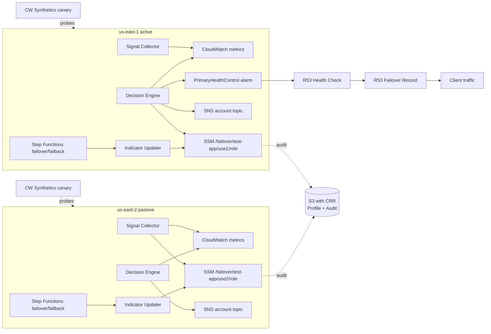

# Diagram 01 — Solution Overview

**Audience:** All audiences. One-page picture of the orchestrator.

```mermaid
flowchart LR
  subgraph US-EAST-1 [us-east-1 active]
    direction TB
    SC1[Signal Collector]
    DE1[Decision Engine]
    SF1[Step Functions failover/failback]
    LU1[Indicator Updater]
    SC1 --> CW1[CloudWatch metrics]
    DE1 --> CW1
    DE1 --> SSM1[SSM /failover/test-app/use1/role]
    SF1 --> LU1 --> SSM1
    DE1 --> SNS1[SNS account topic]
    DE1 --> CWAlarm1[PrimaryHealthControl alarm]
  end
  subgraph US-EAST-2 [us-east-2 passive]
    direction TB
    SC2[Signal Collector]
    DE2[Decision Engine]
    SF2[Step Functions failover/failback]
    LU2[Indicator Updater]
    SC2 --> CW2[CloudWatch metrics]
    DE2 --> CW2
    SC2 --> SSM2[SSM /failover/test-app/use2/role]
    SF2 --> LU2 --> SSM2
    DE2 --> SNS2[SNS account topic]
  end
  CWAlarm1 --> R53HC[R53 Health Check]
  R53HC --> R53[R53 Failover Record]
  R53 --> Client[Client traffic]
  S3CRR[(S3 with CRR\nProfile + Audit)]
  SSM1 -.audit.-> S3CRR
  SSM2 -.audit.-> S3CRR
  Canary1[CW Synthetics canary] -. probes .-> US-EAST-2
  Canary2[CW Synthetics canary] -. probes .-> US-EAST-1
```
