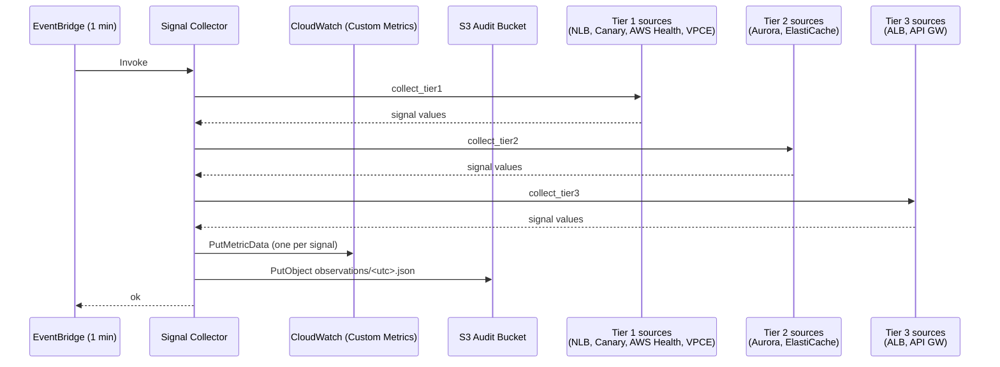

# Diagram 03 — Signal Collection Flow

**Audience:** Engineers debugging signal sources.

```mermaid
sequenceDiagram
  participant EB as EventBridge (1 min)
  participant SC as Signal Collector
  participant CW as CloudWatch (Custom Metrics)
  participant S3 as S3 Audit Bucket
  participant Tier1 as Tier 1 sources<br/>(NLB, Canary, AWS Health, VPCE)
  participant Tier2 as Tier 2 sources<br/>(Aurora, ElastiCache)
  participant Tier3 as Tier 3 sources<br/>(ALB, API GW)

  EB->>SC: Invoke
  SC->>Tier1: collect_tier1
  Tier1-->>SC: signal values
  SC->>Tier2: collect_tier2
  Tier2-->>SC: signal values
  SC->>Tier3: collect_tier3
  Tier3-->>SC: signal values
  SC->>CW: PutMetricData (one per signal)
  SC->>S3: PutObject observations/<utc>.json
  SC-->>EB: ok
```
