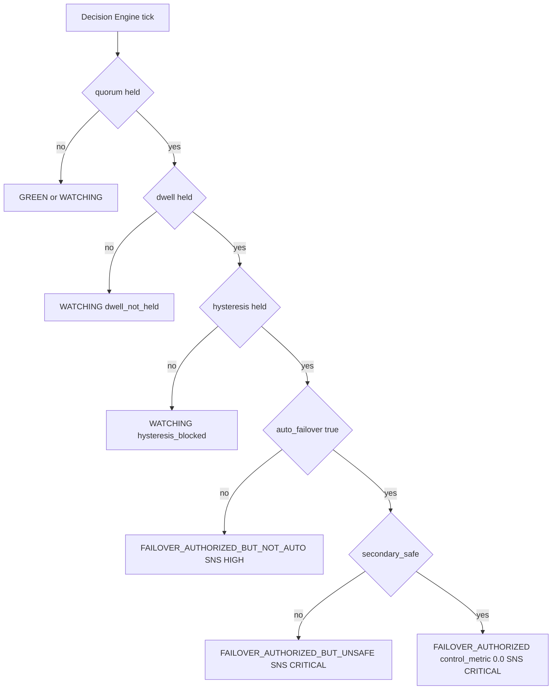

# Diagram 04 — Decision Tree

**Audience:** Engineers debugging false positives / negatives.

The choice nodes are intentionally short (mermaid flowchart parser dislikes
parens and HTML entities inside `{...}` choice labels). For the full
expansion of each gate — quorum threshold, dwell window, hysteresis window,
secondary readiness check — see [`docs/decision-engine.md`](../decision-engine.md) §3.
