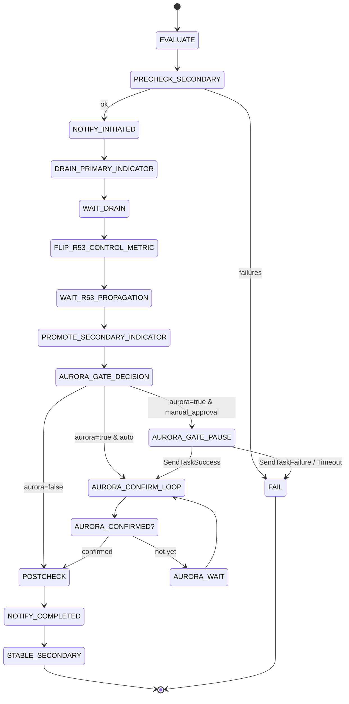

# Diagram 05 — Failover State Machine (DNS-first)

**Audience:** Engineers + SRE on-call.

```mermaid
stateDiagram-v2
  [*] --> EVALUATE
  EVALUATE --> PRECHECK_SECONDARY
  PRECHECK_SECONDARY --> NOTIFY_INITIATED: ok
  PRECHECK_SECONDARY --> FAIL: failures
  NOTIFY_INITIATED --> DRAIN_PRIMARY_INDICATOR
  DRAIN_PRIMARY_INDICATOR --> WAIT_DRAIN
  WAIT_DRAIN --> FLIP_R53_CONTROL_METRIC
  FLIP_R53_CONTROL_METRIC --> WAIT_R53_PROPAGATION
  WAIT_R53_PROPAGATION --> PROMOTE_SECONDARY_INDICATOR
  PROMOTE_SECONDARY_INDICATOR --> AURORA_GATE_DECISION

  AURORA_GATE_DECISION --> AURORA_GATE_PAUSE: aurora=true & manual_approval
  AURORA_GATE_DECISION --> AURORA_CONFIRM_LOOP: aurora=true & auto
  AURORA_GATE_DECISION --> POSTCHECK: aurora=false

  AURORA_GATE_PAUSE --> AURORA_CONFIRM_LOOP: SendTaskSuccess
  AURORA_GATE_PAUSE --> FAIL: SendTaskFailure / Timeout
  AURORA_CONFIRM_LOOP --> AURORA_CONFIRMED?
  AURORA_CONFIRMED? --> POSTCHECK: confirmed
  AURORA_CONFIRMED? --> AURORA_WAIT: not yet
  AURORA_WAIT --> AURORA_CONFIRM_LOOP

  POSTCHECK --> NOTIFY_COMPLETED
  NOTIFY_COMPLETED --> STABLE_SECONDARY
  STABLE_SECONDARY --> [*]
  FAIL --> [*]
```
