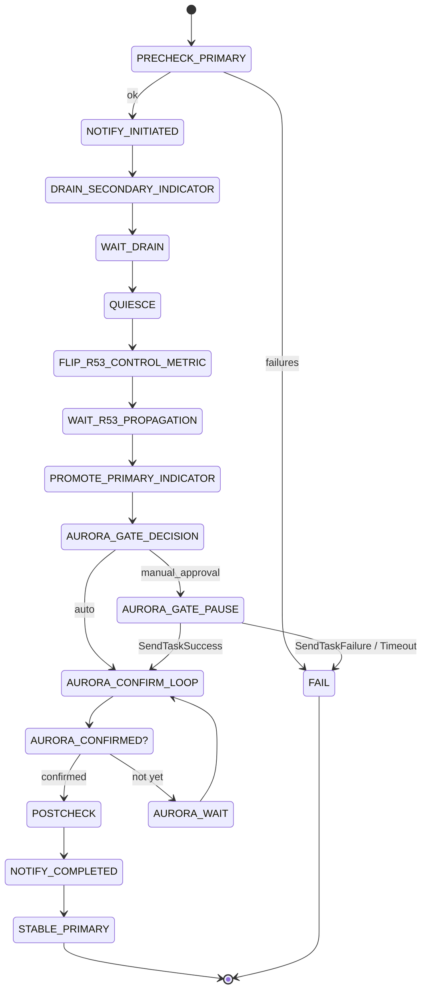

# Diagram 06 — Failback State Machine (DNS-first)

**Audience:** Engineers + SRE on-call.

```mermaid
stateDiagram-v2
  [*] --> PRECHECK_PRIMARY
  PRECHECK_PRIMARY --> NOTIFY_INITIATED: ok
  PRECHECK_PRIMARY --> FAIL: failures
  NOTIFY_INITIATED --> DRAIN_SECONDARY_INDICATOR
  DRAIN_SECONDARY_INDICATOR --> WAIT_DRAIN
  WAIT_DRAIN --> QUIESCE
  QUIESCE --> FLIP_R53_CONTROL_METRIC
  FLIP_R53_CONTROL_METRIC --> WAIT_R53_PROPAGATION
  WAIT_R53_PROPAGATION --> PROMOTE_PRIMARY_INDICATOR
  PROMOTE_PRIMARY_INDICATOR --> AURORA_GATE_DECISION
  AURORA_GATE_DECISION --> AURORA_GATE_PAUSE: manual_approval
  AURORA_GATE_DECISION --> AURORA_CONFIRM_LOOP: auto
  AURORA_GATE_PAUSE --> AURORA_CONFIRM_LOOP: SendTaskSuccess
  AURORA_GATE_PAUSE --> FAIL: SendTaskFailure / Timeout
  AURORA_CONFIRM_LOOP --> AURORA_CONFIRMED?
  AURORA_CONFIRMED? --> POSTCHECK: confirmed
  AURORA_CONFIRMED? --> AURORA_WAIT: not yet
  AURORA_WAIT --> AURORA_CONFIRM_LOOP
  POSTCHECK --> NOTIFY_COMPLETED
  NOTIFY_COMPLETED --> STABLE_PRIMARY
  STABLE_PRIMARY --> [*]
  FAIL --> [*]
```
