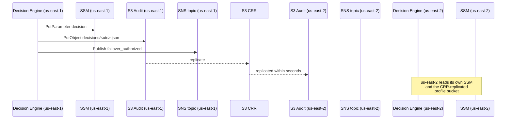

# Diagram 07 — Cross-Region Coordination

**Audience:** Engineers debugging cross-region behavior.

```mermaid
sequenceDiagram
  participant DE1 as Decision Engine (us-east-1)
  participant SSM1 as SSM (us-east-1)
  participant S3-1 as S3 Audit (us-east-1)
  participant SNS1 as SNS topic (us-east-1)
  participant CRR as S3 CRR
  participant S3-2 as S3 Audit (us-east-2)
  participant SNS2 as SNS topic (us-east-2)
  participant DE2 as Decision Engine (us-east-2)
  participant SSM2 as SSM (us-east-2)

  DE1->>SSM1: PutParameter decision
  DE1->>S3-1: PutObject decisions/<utc>.json
  DE1->>SNS1: Publish failover_authorized
  S3-1-->>CRR: replicate
  CRR-->>S3-2: replicated within seconds
  Note over DE2,SSM2: us-east-2 reads its own SSM<br/>and the CRR-replicated<br/>profile bucket
```
