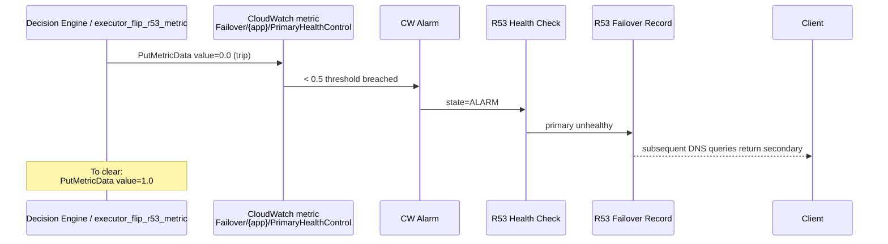

# Diagram 08 — R53 Control Pattern

**Audience:** Engineers explaining how the orchestrator flips DNS.

```mermaid
sequenceDiagram
  participant Lambda as Decision Engine / executor_flip_r53_metric
  participant CW as CloudWatch metric<br/>Failover/{app}/PrimaryHealthControl
  participant Alarm as CW Alarm
  participant HC as R53 Health Check
  participant R53 as R53 Failover Record
  participant Client

  Lambda->>CW: PutMetricData value=0.0 (trip)
  CW->>Alarm: < 0.5 threshold breached
  Alarm->>HC: state=ALARM
  HC->>R53: primary unhealthy
  R53-->>Client: subsequent DNS queries return secondary
  Note over Lambda: To clear:<br/>PutMetricData value=1.0
```
