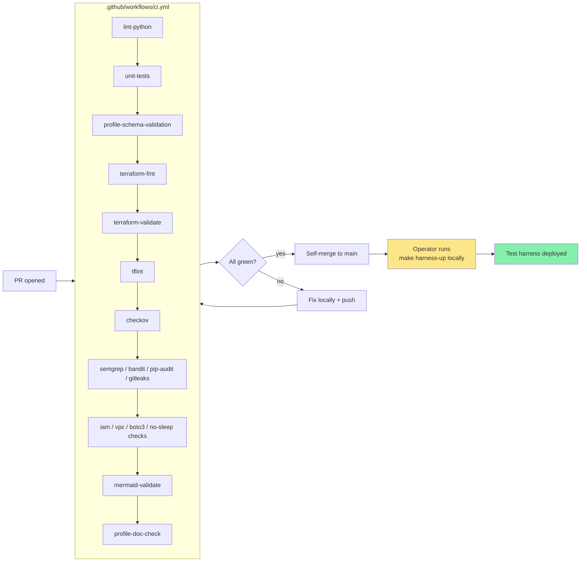

# Diagram 10 — CI/CD Pipeline (POC)

**Audience:** Anyone working on a PR.

Per CLAUDE.md §1.1 + SPEC §11: CI never touches AWS. Deploy is manual.
JPMC port adds the GitHub OIDC + automated CD pipeline.
