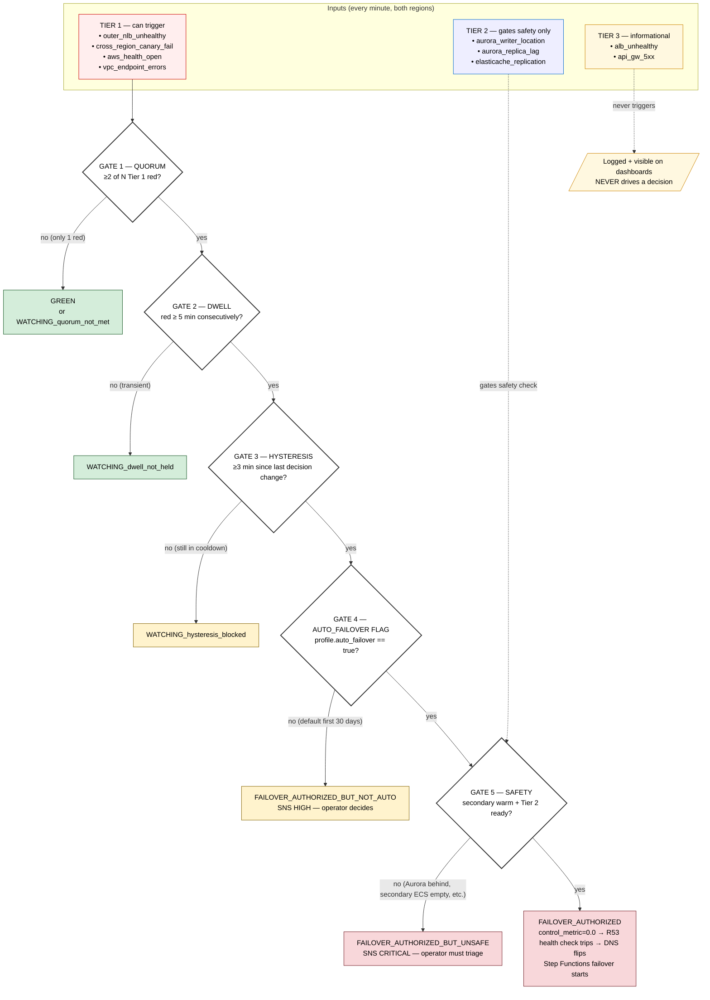
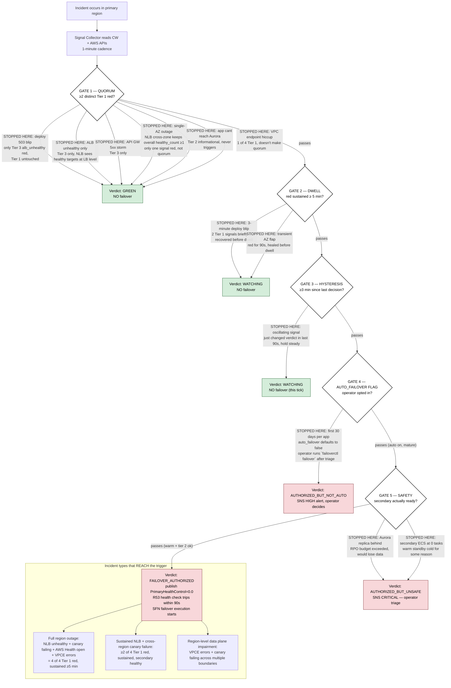

# Diagram 15 — Detection Logic Walkthrough

**Audience:** Customer engineering, SRE, anyone asking "but how does it
know it's a real outage and not just my deploy?"

This is the missing visual: how a raw signal becomes (or doesn't become)
a failover, with **specific scenarios traced through each filter**.

---

## Part A — The signal-to-decision pipeline

Every minute, both regions independently:

1. Collect signals from three tiers of sources
2. Run them through four sequential gates
3. Emit a verdict (`GREEN`, `WATCHING`, `AUTHORIZED_*`, or `EXECUTE`)

**Key principle (read top to bottom):** each gate is **deliberately
suspicious of its inputs**. The gates aren't AND-ed in parallel — they're
chained, and each one is designed to **discard** the next class of false
positive. By the time a signal reaches the bottom, four independent
heuristics have agreed it's real.

---

## Part B — Scenario-by-scenario walkthrough

The same flowchart, with **specific incident types annotated** so you can
see which gate kills which kind of false positive:

**How to read this:** start at the top, follow the path your specific
incident takes. Wherever the chart says "STOPPED HERE: <your incident>",
that's the gate that prevents an over-trigger. Eight kinds of non-impacting
issues are filtered out before any action; only sustained, multi-signal,
infrastructure-level failures with a healthy secondary reach the bottom.

---

## Part C — Verdict matrix (every scenario, what gate it hits)

The 14 SPEC scenarios mapped to the gate that determines their outcome:

| # | Scenario | Tier(s) red | Stopped at | Verdict | Operator action |
|---|---|---|---|---|---|
| 01 | Deployment 503 blip | Tier 3 only | Quorum (Tier 1 untouched) | GREEN | None |
| 02 | ALB unhealthy only | Tier 3 only | Quorum | GREEN | None |
| 03 | Single-AZ outage | 1 Tier 1 | Quorum (only 1 red) | GREEN | In-region recovery |
| 04 | Full region outage | 4 Tier 1 | Reaches bottom | AUTHORIZED → executes | Approve Aurora |
| 05 | API GW 5xx storm | Tier 3 only | Quorum | GREEN | None |
| 06 | App can't reach Aurora | Tier 2 only | Tier 2 doesn't trigger | GREEN | SRE alerted, separate path |
| 07 | Operator dry-run | n/a | Bypasses gates entirely (operator-initiated) | EXECUTE (dry) | Validate |
| 08 | Manual failover w/ Aurora gate | n/a (operator) | Bypasses gates | AUTHORIZED → paused at gate | Approve Aurora |
| 09 | Aurora confirmation timeout | n/a | Aurora gate timeout | FAIL state | Triage Aurora |
| 10 | Failback | n/a (operator) | Bypasses gates | EXECUTE | Approve Aurora |
| 11 | Mid-failover Lambda crash | n/a | SFN Catch+Retry handles | EXECUTE | None (auto-recovered) |
| 12 | Split-brain attempt | n/a | SFN execution-name uniqueness | First wins, second rejected | None |
| 13 | Profile change mid-incident | depends | New profile picked up next tick | Same as new profile says | Confirm profile applied |
| 14 | Canary self-failure | 1 Tier 1 (canary) | Quorum (only 1 red, ignored after canary recovers) | GREEN | Canary infra fix |

**The split:** scenarios 1, 2, 3, 5, 6, 14 are exactly the kinds of
"non-impacting issues" the orchestrator must NOT act on. Notice every
single one is killed at **Gate 1 (Quorum)** — the first filter in the
chain, costing nothing to evaluate.

Scenario 4 is the canonical "real outage" — only scenario where everything
aligns to actually trigger.

Scenarios 7-12 are operator/process scenarios (manual triggers, idempotency,
recovery) — they bypass the detection gates because the operator has already
made the decision.

---

## Part D — Why this design

The four gates aren't arbitrary. Each one targets a specific class of
false positive that operators have learned to fear:

| Gate | Targets which historical false-positive class |
|---|---|
| Quorum (≥2 Tier 1) | Single-source noise — one canary, one VPCE error, one Health event scoped to a different service |
| Dwell (≥5 min) | Deploy-induced blips, transient retries, intra-AZ failover events |
| Hysteresis (≥3 min) | Signal flapping causing decision oscillation between WATCHING and AUTHORIZED |
| Auto-failover flag | New apps without enough operating data for safe automation |
| Safety (Tier 2 + warm) | "Trigger but lose data" — failover that would corrupt or lose Aurora writes |

This is **failover-cost-aware design**: a false-positive failover costs
real money (cross-region traffic, Aurora promotion downtime, operator hours
to fail back). The asymmetry between false-positive cost (high) and
false-negative cost (handled by the on-call rotation seeing the alarm and
triggering manually) drives the bias toward "miss rather than over-trip."

Profile owners can tune the gates per-app:

- App with high noise floor → raise `tier1_quorum` to 3
- Slow-recovering app → raise `dwell_minutes` to 10
- Stable, trusted automation → flip `auto_failover: true`

See [`docs/decision-engine.md`](../decision-engine.md) §4 for the full
tunable list and [`docs/profile-reference.md`](../profile-reference.md)
for syntax.

---

_Last reviewed: 2026-04-28._
