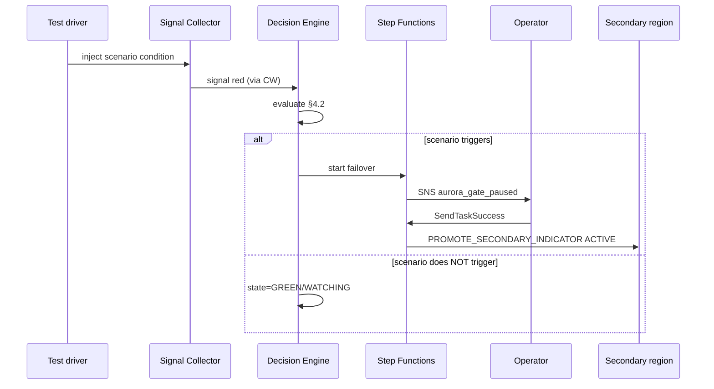

# Scenario 03 — Single AZ outage

**Audience:** Engineers + SREs.
**Summary:** Single AZ outage in primary; surviving AZs keep NLB UnHealthyHostCount > 0.

## Setup

Profile: `profiles/test-app.yaml` defaults (auto_failover=false unless
otherwise noted; tier1_quorum=2; dwell_minutes=5; hysteresis_minutes=3).

Initial state: `make harness-up` complete; both regions GREEN; primary
indicator ACTIVE; secondary indicator unset.

## Sequence of events

| t (min) | Layer | Event |
|---|---|---|
| 0 | Test driver | Inject the scenario condition (see `tests/chaos/test_scenario_03_single_az_outage.py`). |
| 1 | Signal Collector | Emits the affected signal value to CW. |
| 1+ | Decision Engine | Evaluates the rule per §4.2. |

## Signal state at each tick

(See `docs/decision-engine.md` §2 for signal definitions.)

## Decision evaluation

The rule from `docs/decision-engine.md` §1 fires (or does not fire) based on
which gates are held. The expected outcome for this scenario:

> **GREEN; outer_nlb_unhealthy stays green because at least one AZ has healthy targets.**

## Operator actions

For non-mutating scenarios (1, 2, 3, 5, 13, 14): none. SRE on-call sees
SNS alerts but does not act.

For mutating scenarios with manual gates (4, 8, 10): see
[`runbooks/RUNBOOK-manual-failover.md`](../../runbooks/RUNBOOK-manual-failover.md)
and [`runbooks/RUNBOOK-aurora-promotion.md`](../../runbooks/RUNBOOK-aurora-promotion.md).

## Final outcome

GREEN; outer_nlb_unhealthy stays green because at least one AZ has healthy targets.

## What this proves

Multi-AZ topology keeps Tier 1 green during single-AZ failures.

## Sequence diagram

_Last reviewed: 2026-04-27._
